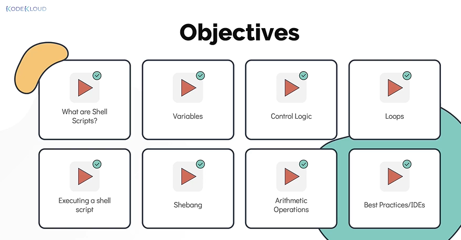

# Course Introduction
  - Take me to [Video Tutorial](https://kodekloud.com/topic/course-introduction-2/)

#### Shell scripts in linux are easy to use time saving solution for automating repetative (or) complex set of tasks in a system administrator daily life.

## In this section, we will take a look at the below.
- Why shell scripts?
- Who is this for?
- Fun Lectures: We will learn in fun way with examples.
- We will also see a number of real world use cases of script through out this course.
- Hands-On labs

## Objectives

   
   
## Pre-Requisites
- Linux Basics
- Command Line Basics
- No Programming knowledge required
   
## Why Shell Scripts?
- Automate Daily Backups
- Automate Installation and Patching of Software on multiple servers 
- Monitor System Periodically
- Raise alarms and send notifications
- Troubleshooting and Audits
- Many more

## Who is this for?
- System Administrators
- Developers
- IT Engineers
- Absolute Beginners
- No Programming Experience

