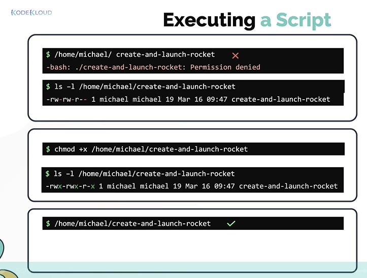
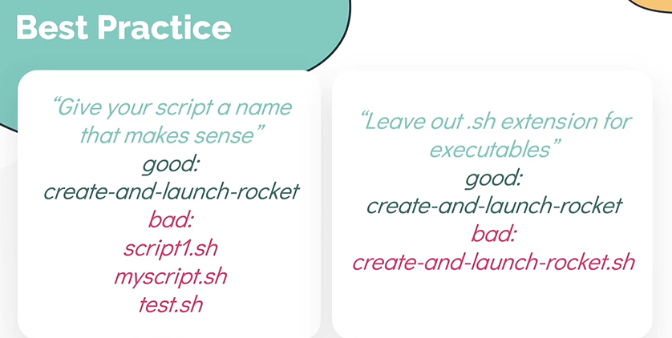

# Creating your first shell script
  - Take me to [Video Tutorial](https://kodekloud.com/topic/creating-your-first-shell-script/)
  
In this section, we will take a look at creating your first shell script.

To Create a shell script name create-and-launch-script.sh
```
$ vi create-and-launch-script.sh
```


## Run script as command
- There are different ways to execute a shell script
  - Execute a shell script with **`bash`** command
    ```
    $ bash create-and-launch-script.sh
    ```
  - Execute a shell script as an **`executable`**
    ```
    $ create-and-launch-script.sh
    ```
    **`Note`**: It is a best practice to not name your script with the **`.sh`** extension when you would like to create an executable of a script.
    ```
    $ create-and-launch-script
    ```
 
## Configure a script to run as command
- Whenever a command is run at a linux system, the O.S looks at the path configured in the **`$PATH`** environment variable to locate the executable or script for the command.
- If it cannot find the command in the **`$PATH`** then a **`command not found`** error will be thrown.

- To add our script as a command, append the path to the directory containing the script to the end of the $PATH variable.
  ```
  $ export PATH=/usr/local/sbin:/usr/local/bin:/usr/sbin:/usr/bin:/sbin:/bin:/home/michael
  ```
- A better way to do this is to append the path to the directory to $PATH variable
  ```
  $ export PATH=$PATH:/home/michael
  ```
- Run the command
  ```
  $ create-and-launch-script
  ```
- To see the location of the command
  ```
  $ which create-and-launch-script
  ```

 

## Executing a script
- For a shell script to work, we must set the correct permissions to the file, if the permissions are not set a "Permission Denied" error will be thrown when you run the script for the first time.

- Inspect the file permissions
  ```
  $ ls -l /home/michael/create-and-launch-script
  ```
- Add executable permissions to a file and then inspect the file to check if it got write permissions.
  ```
  $ chmod +x /home/michael/create-and-launch-script
  $ ls -l /home/michael/create-and-launch-script
  ```
- Now, run the script
  ```
  $ /home/michael/create-and-launch-script
  ```

 
 
## Best Practices

  
