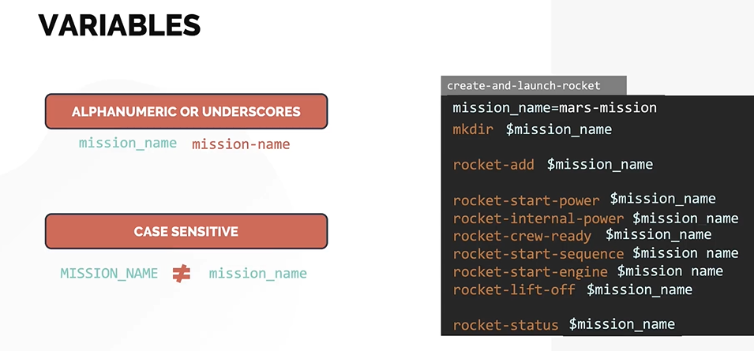
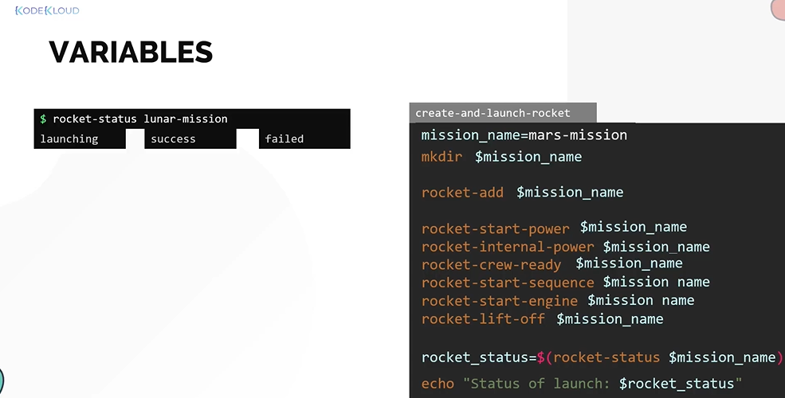
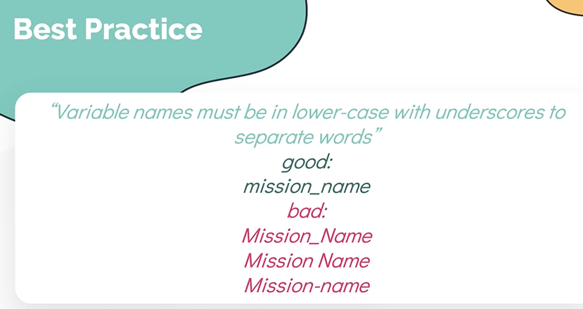

# Variables
  - Take me to [Video Tutorial](https://kodekloud.com/topic/variables/)

In this section, we will take a look at variables in shell script.

## A Variable in Shell script
- A variable is a value that can vary or change.
- A variable always has a **`$`** sign before it's name.
- A variable name may only contain alphanumeric or underscores
- A variable is case sensitive as well.
- To set the value for a variable
  ```
  $ mission_name=lunar-mission
  ```
 
  

- We can also use variables to store the result of another command and print it.
  ```
  $ rocket_status=$(rocket-status $mission_name)
  $ echo "Status of launch: $rocket_status"
  ```
  
  

## Best Practices

  
  
