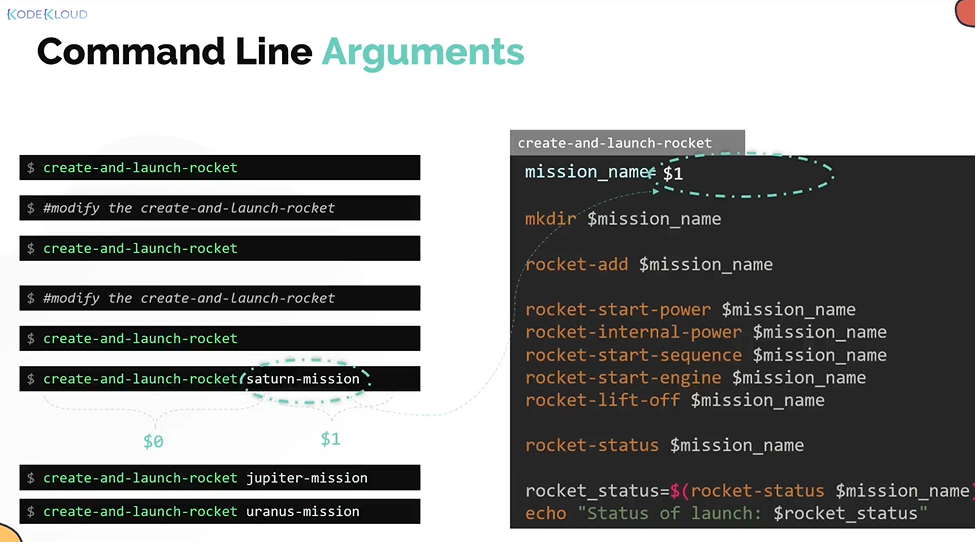
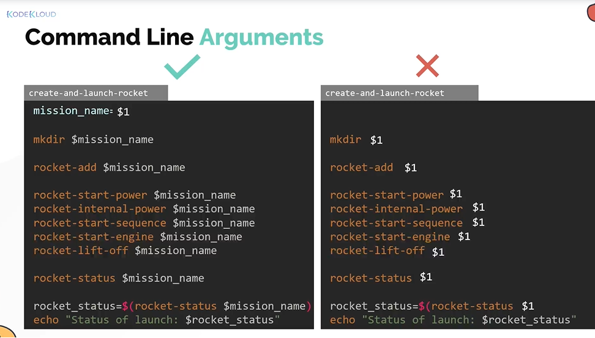
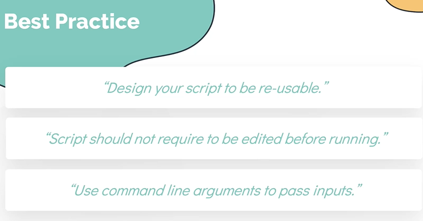

# Command Line Arguments
  - Take me to [Video Tutorial](https://kodekloud.com/topic/command-line-arguments/)
  
In the section, we will take a look at "Command Line Arguments" in shell scripts.

We can replace the hardcoded names within our script with the built in variable.
- $0, $1, $2, $3 ... etc. are built in variables.
  
  

## Best Practices
- It is a best practice to assign a varaible to a meaningful variable name

  
  
  
  

  
