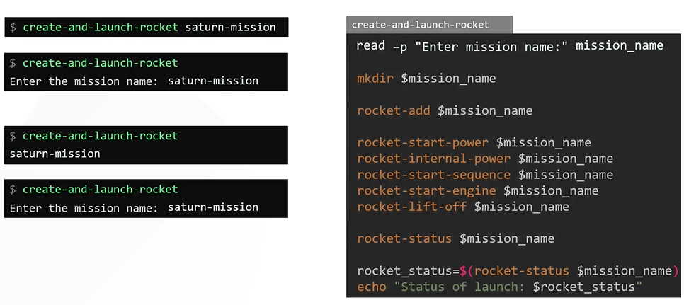
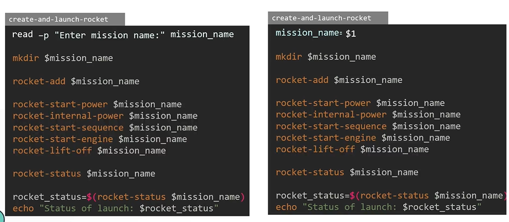

# Read Inputs
  - Take me to [Video Tutorial](https://kodekloud.com/topic/read-inputs/)
  
In this section, lets take a look at prompting for inputs in a shell script

To prompt the user for input, use the **`read`** statement followed by adding a **`prompt`** with **`-p`** option.
```
$ read -p "Enter mission name:" mission_name
```



When to use **`Command Line Arguments`** and **`Read Inputs`** ?


