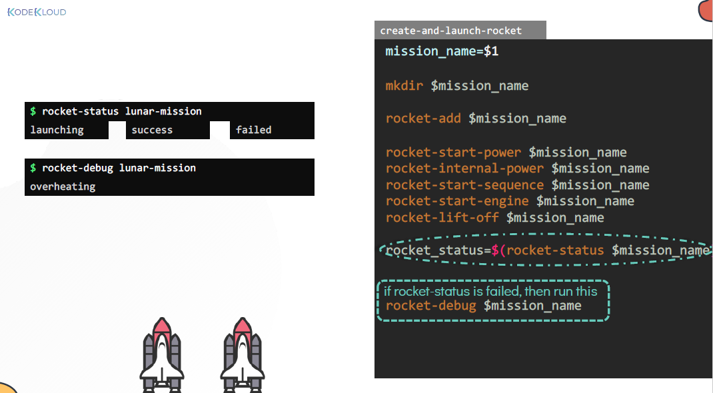
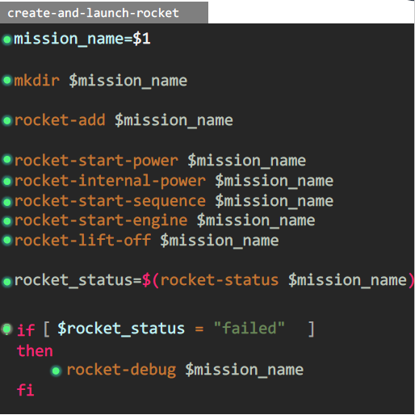
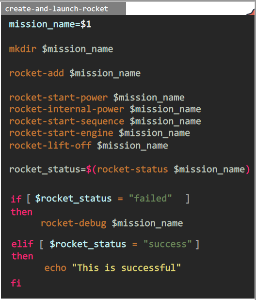
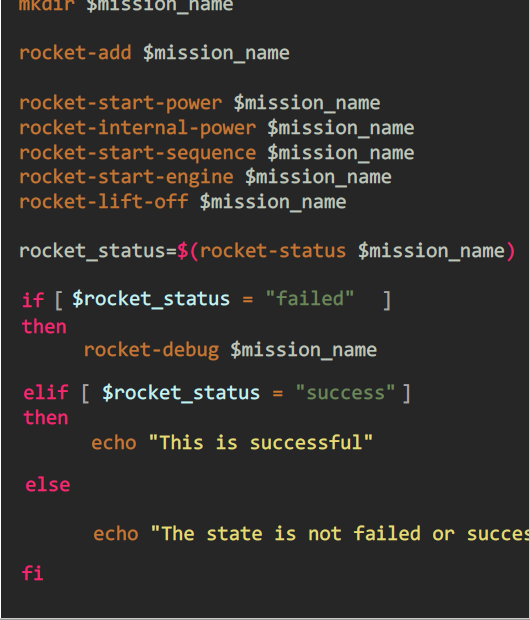
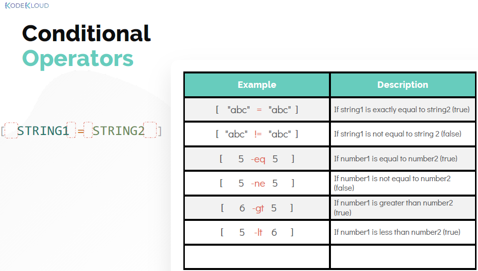
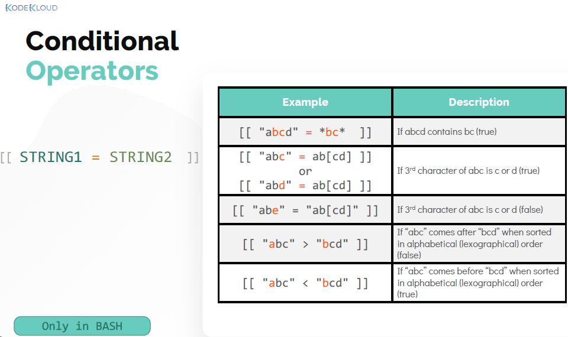
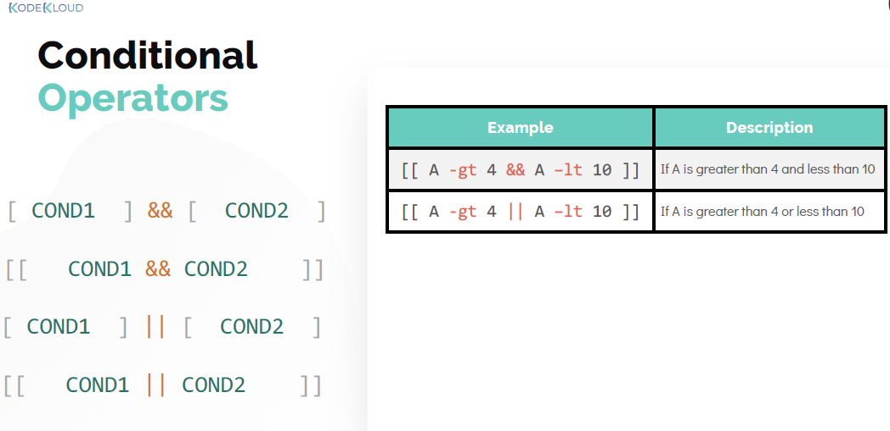
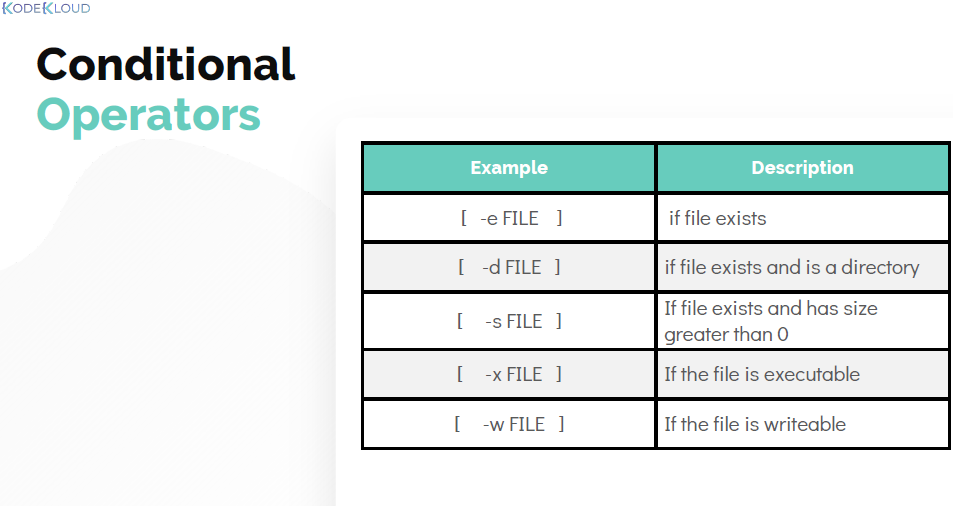

# Conditional Logic

  - Lets understand [Conditional-Logic](https://kodekloud.com/topic/conditional-logic/)

    #### Create and Launch Rocket

    - To Check the status of the rocket use below command: 

       ```
       $ rocket-status lunar-mission
       ```
    
    - To debug the status of the rocket.

       ```
       $ rocket-debug lunar-mission
       ```

    

    #### Conditional Statement

    - **`if`** is defined as 
      
      ```
      if [ $rocket_status = "failed" ]
      then
        rocket-debug $mission_name
      fi 
      ```

       

    - **`elif`** condition is defined as

      ```
      if [ $rocket_status = "failed" ]
      then
        rocket-debug $mission_name
      elif [ $rocket_status = "success" ]
      then
        echo "This is successful"
      fi 
      ```

      

    - **`else`** is written as 

      ```
      if [ -d "/home/bob/caleston" ]
      then
        echo "Directory exists"
      else
        echo "Directory not found"
      ```

      

    #### Conditional Operators

    - Comparing statement can be used as:
     
      

    
    - Conditional Operators that works in **`bash`**

      

    
    - **`AND`** and **`OR`** Operators

      


    - Conditional operation description

      
      
