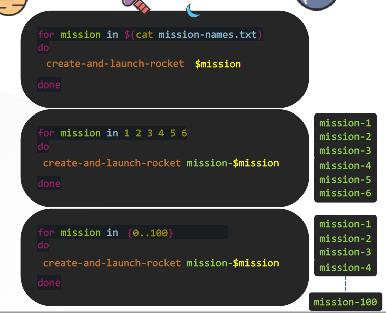
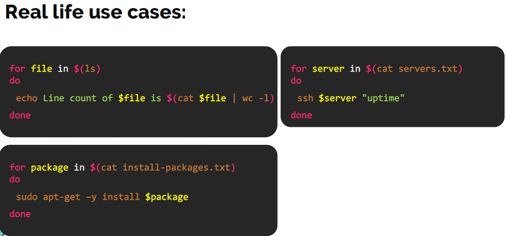

# Loops

  - Loops is used for repetative tasks, lets understand how it works in this [lecture](https://kodekloud.com/topic/loops-for/)

  ### Type of Loops

  - **`for`** loops is used when you want to run same command multiple times
  - Execute a command or a set of commands many times
  - Iterate through files
  - Iterate through lines within a file
  - Iterate through the output of a command

  - **`for`** loops can be written in multiple ways:

    ```
    for mission in <list of missions>
    do
      create-and-launch-rocket $mission
    done
    ```

    ```
    for mission in 1 2 3 4 5 6
    do
      create-and-launch-rocket $mission
    done
    ```    

    ```
    for mission in {0..100}
    do
      create-and-launch-rocket $mission
    done
    ```

    


  - Real life use case can be:

  - Iterate thorugh list of files from the output of the **`ls`** command

  - Iterate thorugh list of packages store them in a file and installs them one by one.

  - **`ssh`** to the list of servers and check there **`uptime`** .

    ```
    for file in $(ls)
    do
     echo Line count of $file is $(cat $file | wc -l)
    done
    ```

    ```
    for server in $(cat servers.txt)
    do
     ssh $server "uptime"
    done
    ```

    ```
    for package in $(cat install-packages.txt)
    do
     sudo apt-get –y install $package
    done
    ```
    
    