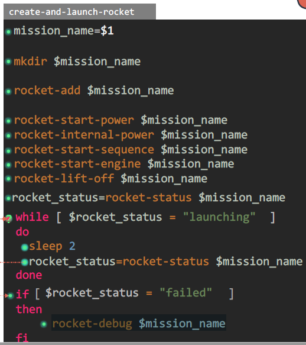
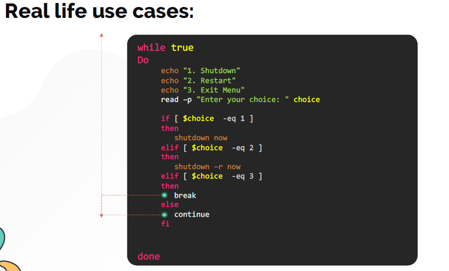

# While Loop

  - Help me to understand the [while loop](https://kodekloud.com/topic/loops-while/)

  - While loop works just like the for loop, except theat it executes the loop as long as the condition is true.
  - Execute a command or a set of commands multiple times but you are not sure how many times.
  - Execute a command or a set of commands until a specific condition occurs
  - Create infinite loops
  - Menu driven programs

    ### Examples of while loop

    ```
    mission_name=$1

    mkdir $mission_name
    
    rocket-add $mission_name
    
    rocket-start-power $mission_name
    rocket-internal-power $mission_name
    rocket-start-sequence $mission_name
    rocket-start-engine $mission_name
    rocket-lift-off $mission_name
    rocket_status=rocket-status $mission_name
    
    while [ $rocket_status = "launching" ]
    do
     sleep 2
     rocket_status=rocket-status $mission_name
    done
 
    if [ $rocket_status = "failed" ]
    then
      rocket-debug $mission_name
    fi
    ```

    


  - Real life use case can be :

    