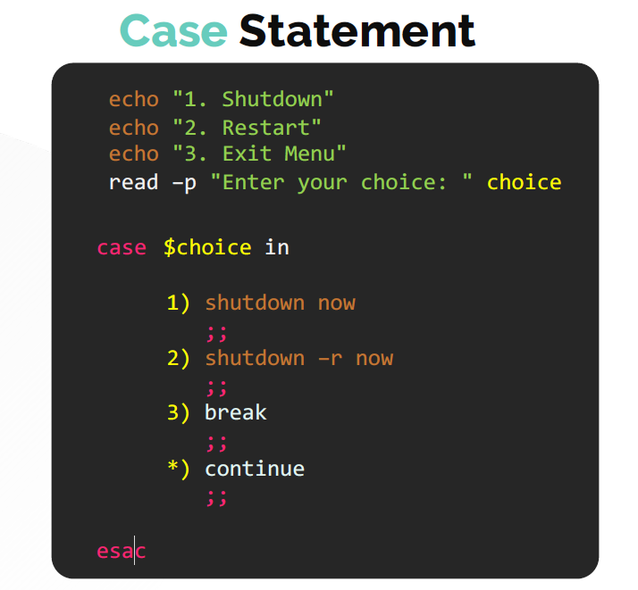
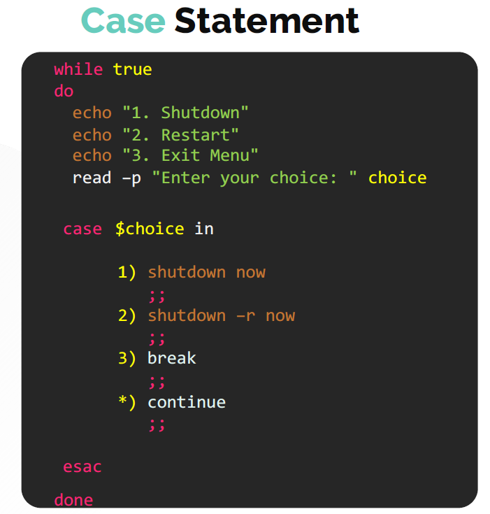

# Case Statements

  - Lets understand [Case Statement](https://kodekloud.com/topic/case-statements/)

  - Case statement is used for simplifying multiple condition check with multiple different choices. 
  
    ```
    echo "1. Shutdown"
    echo "2. Restart"
    echo "3. Exit Menu"
    read –p "Enter your choice: " choice

    case $choice in

        1) shutdown now
           ;;
        2) shutdown –r now
           ;;
        3) break
           ;;
        *) continue
           ;;

    esac
    ```

    


  - Case statement can also be written along with the **`while`** loop as shown

    ```
    while true
    do
      echo "1. Shutdown"
      echo "2. Restart"
      echo "3. Exit Menu"
      read –p "Enter your choice: " choice
  
      case $choice in
  
          1) shutdown now
             ;;
          2) shutdown –r now
             ;;
          3) break
             ;;
          *) continue
             ;;
  
      esac
    done
    ```
    