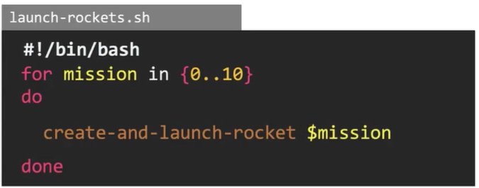
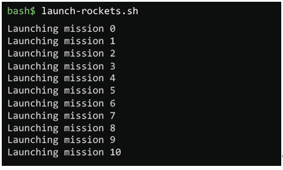
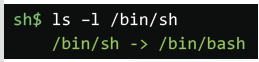
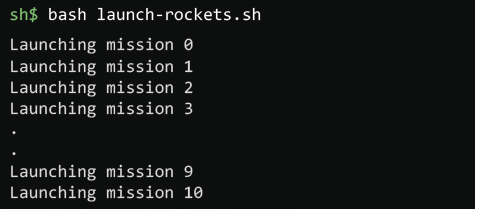

# Shebang

  - Lets understand [Shebang](https://kodekloud.com/topic/shebang/)

  - In this lecture we will understand the types of shell, **`Bourne Shell(sh)`**, **`Bourne again Shell(bash)`**, **`C Shell`**, **`Z Shell`** etc..

  - A Shebang statement is a line that you specify at the top of the shell script and is used to specify what shell a script must run in.

  - Shebang instructs the shell to use a particular shell or interpreter for the script, below case tells us that the script should run in the bash shell

      

    ### Bourne again Shell

    - Bourne again Shell, it will print the sequence as expected. It will generate the sequence 0 to 10

      

    
    ### Bourne Shell or Debian Almquist Shell(dash)

    - Bourne Shell, if you try to run the same script in **`dash shell`**, it doesnt know how to expand this expression into a seuqnce of numbers

      

    - Bourne Shell is, in fact, the(bash) shell itself, it is linked to the (bash).

      

    ### Other Shell

    - If you want to run the script from another shell, thats not a(bash) shel, then you must just run it through the(bash) shell by prefixing the **`bash`** command

      