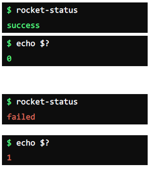
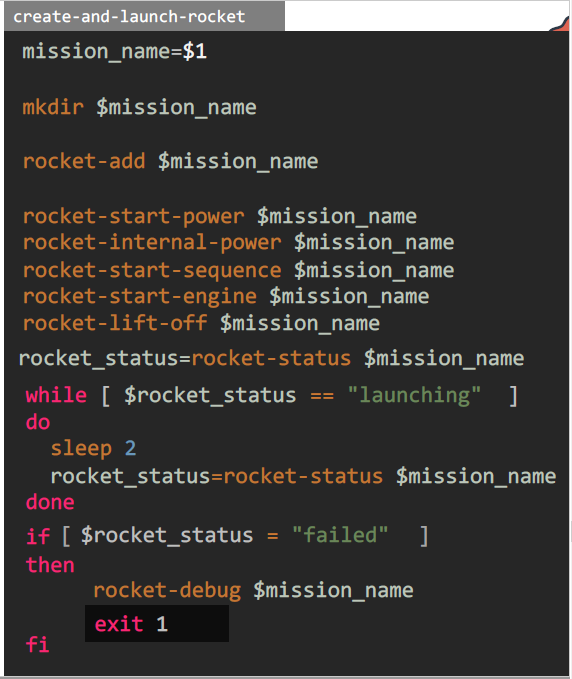

# Exit Codes

  - Lets understand [Exit-Codes](https://kodekloud.com/topic/exit-codes/)

  - In this lecture we will understand the Exit-Codes and different types of Exit Codes.

    

    

  - Command to check the exit code of the the last executed command is  **`echo $?`**

  - For example to check the status of command **`rocket-status`** use

    

  - If the launch of the rocket is successfull then exit code should be **`zero`** and if it fails it should be a **`non-zero`** value

  - If the launch of the rocket is failed then script should return 1 this can be modified in the script to retrun a exit-code.

    