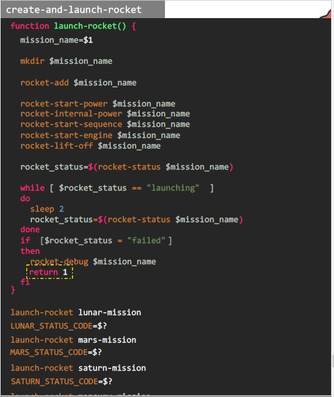
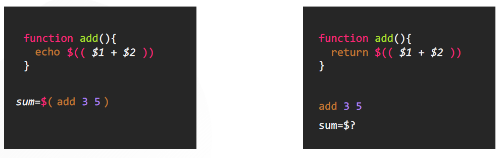

# Functions

  - Lets understand [Functions](https://kodekloud.com/topic/functions/)

  - Functions within a shell script is a piece of code or a block of code that perform a particular function that can be reused.

    

  - When a shell script runs it runs line-by-line. So your Function must **`always be defined first`** before calling it, if not then it will give error.

  - The return statement within a function call helps in specifying the exit code for that function. It is just like the exit code for the entire script but in this case it 
    wont exit the script but the function.

    

  - When to use Functions?

    - Break up large script that performs many different tasks
    - Installing packages
    - Adding users
    - Configuring firewalls
    - Perform Mathematical calculations

  - Function to add two numbers, returning the value of addition to a variable called **`sum`** and outputing the exit code of previouly run command

    
    
    