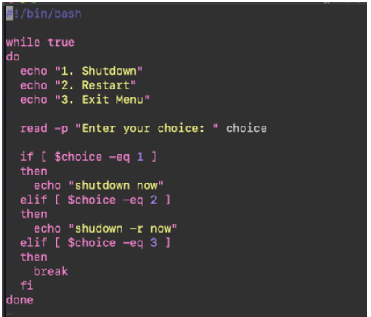
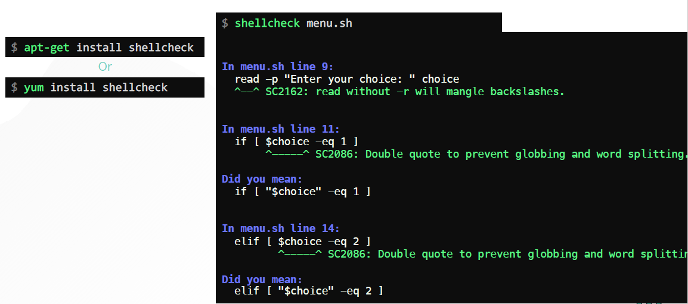
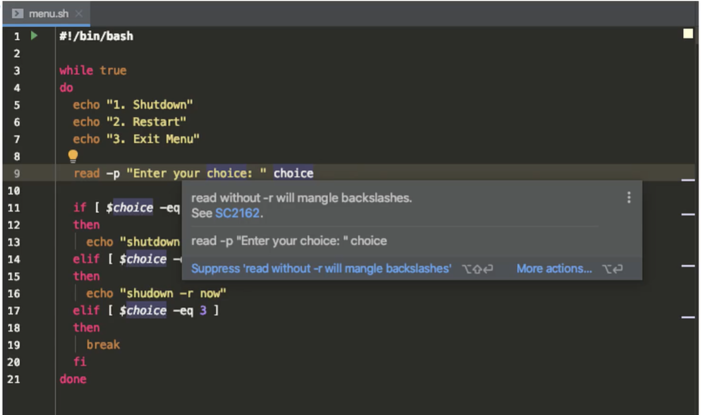

# Tipes & Tricks - ShellCheck & IDE

  - Lets understand about [shellcheck and IDE](https://kodekloud.com/topic/tips-tricks-shellcheck-ide/)

  - VIM provides syntax highlighting, which helps in catching any syntax error in your shell scripts.

    

    ### ShellCheck

    - To analyze and identify bugs and area of improvement in your script use **`shellcheck`** utility based on your OS
  
      ```
      apt-get install shellcheck
  
      OR
  
      yum install shellcheck
  
      ```
      [ShellCheck-Github](https://github.com/koalaman/shellcheck)

      
      

    
    ### IDE

    - The **`JetBrains PyCharm`** supports a development environment for Python, but it also has plugin for shell scripts
    - It also provides syntax highlighting and recommendations to improve your script.


      

    
    ### Editors 

    - Visual Studio Code and Atom can be used as an editor tool.


    ### Styleguide

    - Google's **`styleguide`** can be used too for writing shell scripts.

      [styleguide](https://google.github.io/styleguide/shellguide.html)

