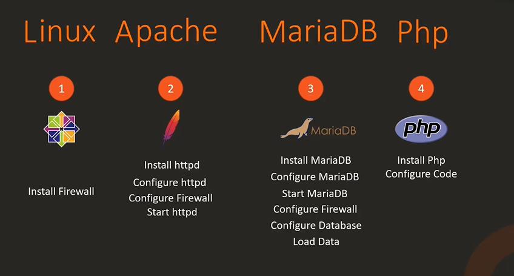
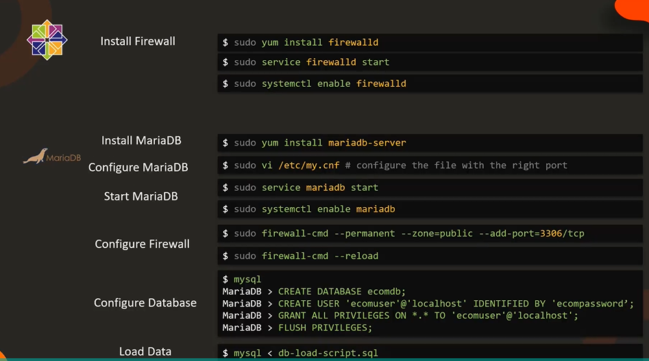
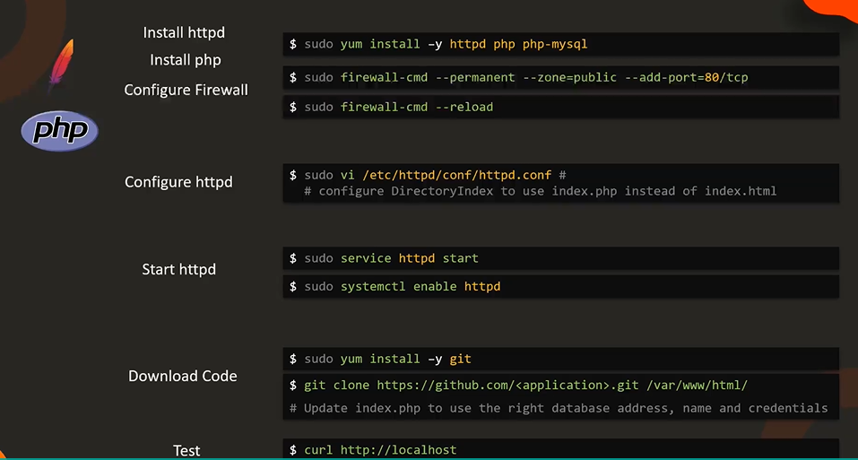

# E-Commerce-Application-Introduction

  - Take me to [Video Tutorial](https://kodekloud.com/topic/project-kodekloud-e-commerce-application-3/)

In this section, we will now introduced to a project that we will work on. 
- We will deploy the kodekloud e-commerce website.
- We will work on setting up a lab environment, then we will deploy the application.

The KodeKloud e-commerce website is a fictional online store that sells electronic devices.
- It's a LAMP stack application, deployed on Linux with Apache Server that uses MariaDB database and a PHP programming language.

  
  
## Install and Configure

   - Install firewalld
     ```
     $ sudo yum install firewalld
     ```
   - Start firewalld service
     ```
     $ sudo service firewalld start
     ```
   - Enable the service at boot
     ```
     $ sudo systemctl enable firewalld
     ```
     
   - Install MariaDB
     ```
     $ sudo yum install mariadb-server
     ```
   - Configure MariaDB
     ```
     $ sudo vi /etc/my.cnf 
     ```
   - Start the MariaDB service
     ```
     $ sudo service mariadb start
     ```
   - Enable the service at boot
     ```
     $ sudo systemctl enable mariadb
     ```
   - Configure Firewall and reload the firewall
     ```
     $ sudo firewall-cmd --permanent --zone=public --add-port=3306/tcp
     $ sudo firewall-cmd --reload
     ```
   - Configure Database
     ```
     $ mysql
     MariaDB > CREATE DATABASE ecomdb;
     MariaDB > CREATE USER 'ecomuser'@'localhost' IDENTIFIED BY 'ecompassword';
     MariaDB > GRANT ALL PRIVILEGES ON *.* TO 'ecommuser'@'localhost';
     MariaDB > FLUSH PRIVILAGES;
     ```
   - Load Inventory Data
     ```
     $ mysql < db-load-script.sql
     ```
  
  
  
  
   - Install httpd and php
     ```
     $ sudo yum install -y httpd php php-mysql
     ```
   - Configure Firewall
     ```
     $ sudo firewall-cmd --permanent --zone=public --add-port=80/tcp
     $ sudo firewall-cmd --reload
     ```
   - Configure httpd
     ```
     $ sudo vi /etc/httpd/conf/httpd.conf
     ```
   - Start the httpd service
     ```
     $ sudo service httpd start
     ```
   - Enable the service at boot
     ```
     $ sudo systemctl enable httpd
     ```
   
   - Install git and download all supporting code for our e-commerce application
     ```
     $ sudo yum install -y git
     $ sudo git clone https://github.com/<application>.git /var/www/html/
     ```
     
   - Test your work using curl
     ```
     $ curl http://localhsot
     ```
   
  
  
  
 
